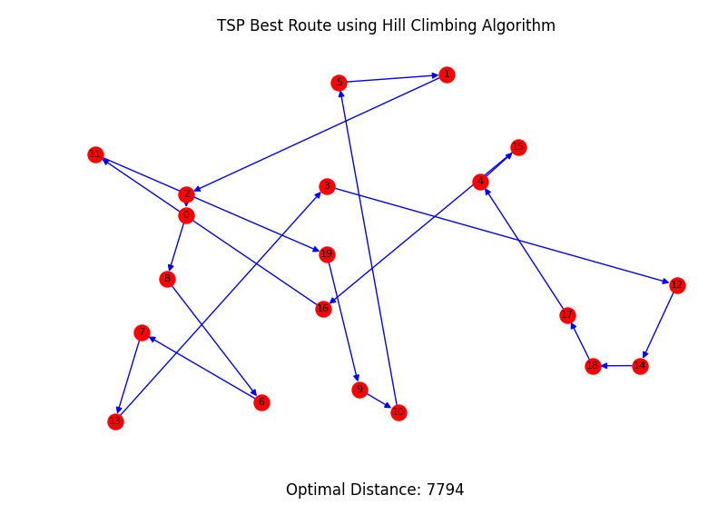
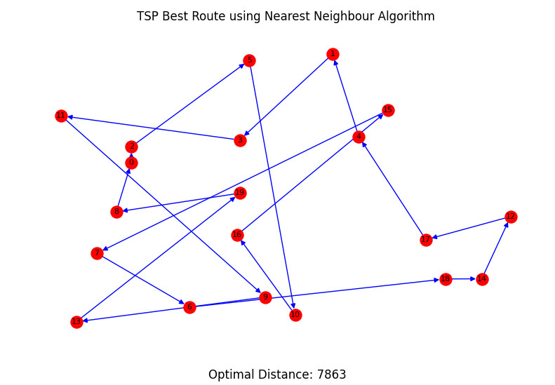
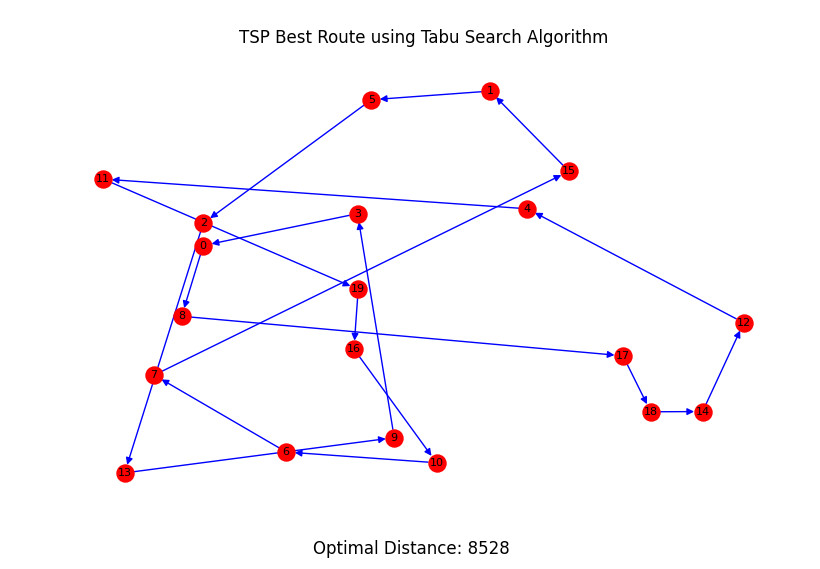
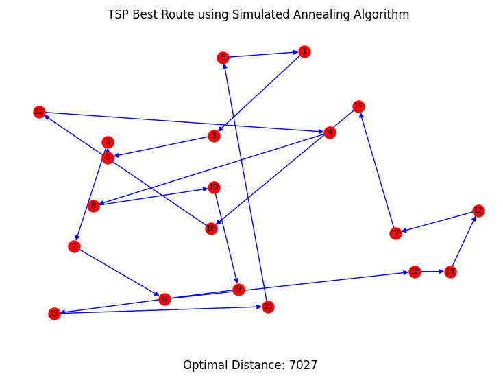

# Traveling-Salesman-Problem
## Description
This project was developed for the Computational Intelligence course at AGH University of Science and Technology during the 2021/2022 academic year. It features four custom-designed algorithms created from scratch, developed as part of my personal exploration and problem-solving efforts beyond regular coursework, specifically focusing on the Symmetrical Traveling Salesman Problem (TSP). The project's structure and code have been refactored for clarity and efficiency. The algorithms showcased here are frequently integrated with **Machine Learning** algorithms.

## Algorithms
The presented results are intended for demonstration purposes only. Finding the optimal solution requires sufficient time and careful tuning of the parameters.

**Hill Climbing**

**Nearest Neighbour**

**Tabu Search**

**Simulated Annealing**

## Technology stack
- Python
